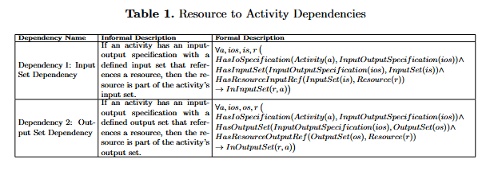
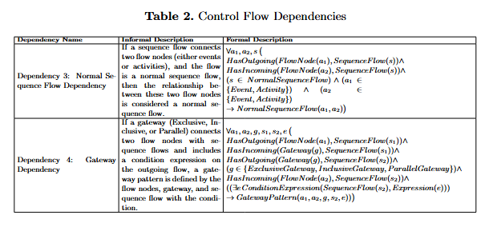
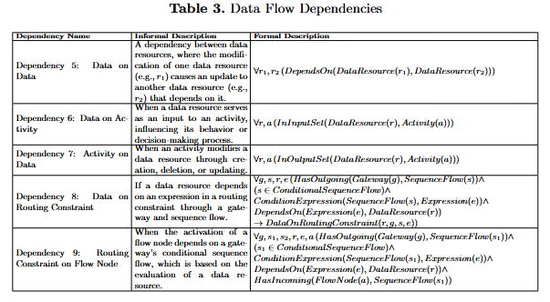

# Conceptualizing Process Dependencies That Propagate Cyber Risk

## Abstract
This paper addresses the critical challenge of understanding how cyber risks propagate within business processes, driven by increasing interconnectivity due to IoT and cloud adoption. Existing research often neglects comprehensive process-aware perspectives, particularly the intricate dependencies across business process components. This gap motivates our work to explore how cyber risks, originating at the infrastructure level, cascade through processes, impacting business process components.

We propose a conceptualization as the primary contribution, capturing the representation of business process components, dependencies, cyber risk events, and inference rules to elucidate risk propagation. The conceptualization synthesizes insights from literature and incorporates risk inference rules to address control flow, data flow, and resource-to-activity dependencies. 

A proof-of-concept implementation demonstrates the model's practical utility by analyzing risk propagation within a credit evaluation business process. Our findings emphasize the importance of a nuanced understanding of business process dependencies, revealing how confidentiality, integrity, and availability risks propagate. This work lays the foundation for more robust process-aware risk assessments, offering significant implications for mitigating cascading cyber risks in interconnected business environments.

## Resources

- **OWL File**: The OWL file of the credit request evaluation process can be found [here](./bbo_credit_request.xml).
- **Cypher Queries**: Implementation of the inference rules is available [here](./queries).

### Inference Rules Table

| Inference Rule Number | Cypher Query Name            |
|------------------------|-----------------------------|
| Rule 1                | `1_Create_the_graph.cypher` |
| Rule 2                | [Add other queries]         |

- **Python Script**: The script for running the inference is available [here](./risk_prop_demo.py).

## Formal Description of Process Dependencies

The following tables presents the formal description of the process dependencies:

